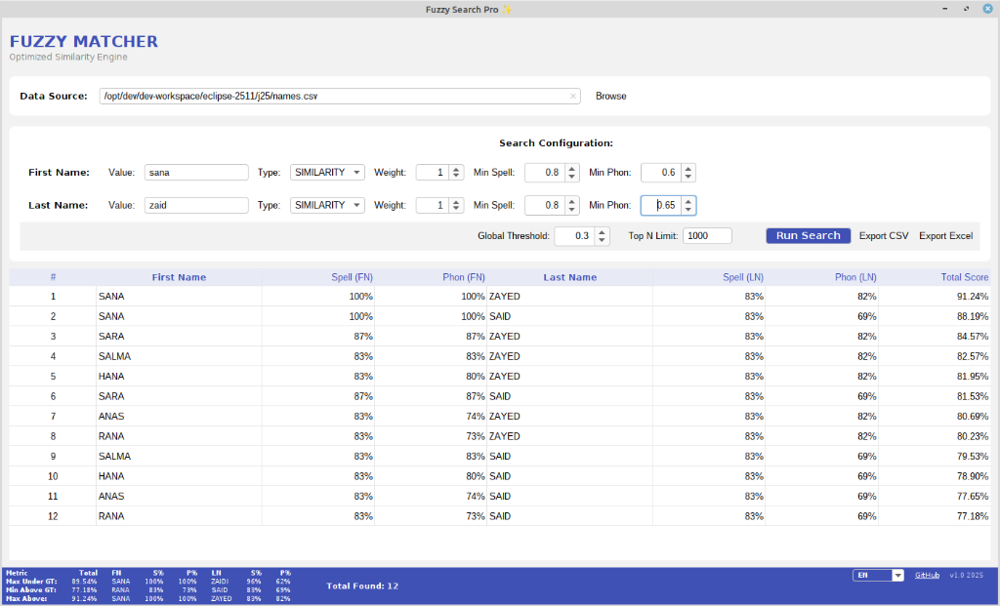
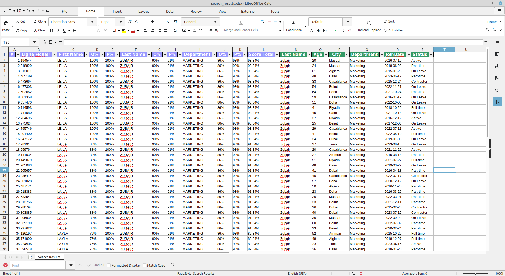

# 🧶 MakFuzz
> **The Ultimate Fuzzy Matching Engine for Data Cleaning & Deduplication** ✨





---

## 🚀 What is MakFuzz?

**MakFuzz** is a powerful, desktop-based fuzzy search utility designed to find needles in haystacks. Whether you are deduplicating customer records, matching messy implementation lists, or just trying to find "John Smith" in a list of "Jon Smythes", MakFuzz has your back!

It goes beyond simple string matching by combining **Spelling Similarity** (how it looks) with **Phonetic Similarity** (how it sounds) to give you the most accurate matches possible. 🎧🔡

---

## ✨ Key Features

### 🧠 Dual-Core Engine
- **Spelling Strategy**: Utilizing `Jaro-Winkler` distance to catch typos and visual similarities.
- **Phonetic Strategy**: Powered by `Beider-Morse` and `Double Metaphone`, it understands how names *sound* across different languages (French, English, Generic).

### 🎛️ Granular Control
- **Dynamic Column Selection**: Choose any columns from your CSV to use as search criteria—not limited to first/last names!
- **Weighted Criteria**: Assign different importance to each criterion (e.g., Weight 1 vs Weight 3) to drive your scoring logic.
- **Multiple Criteria**: Match on as many columns as you need—mix and match names, IDs, addresses, or any data fields.
- **Strict Thresholds**: Set minimum quality bars per criterion. E.g., "Must be at least 80% phonetically similar to even be considered."

### 📊 Rich Analytics
- **Live Dashboard**: See real-time breakdown of scores for each criterion:
  - `S%` (Spelling Score)
  - `P%` (Phonetic Score)
  - `Total Score` (Weighted Average)
- **Deep Dive Stats**: The footer isn't just a footer—it's a data goldmine showing:
  - **Max Under Threshold**: The best match that *didn't* make the cut (your "near misses").
  - **Min Above Threshold**: The worst match that *did* make the cut.
  - **Total**: Instant count of all findings.

### 💾 Smart Persistence
- **Auto-Save**: Closing the app? No stress! MakFuzz saves your entire workspace (paths, weights, thresholds, selected columns) to `~/.makfuzz_config.xml` automatically. It's ready exactly as you left it next time. 🔄

### 📤 Export Power
- **CSV & Excel**: One-click export of your filtered results to standard formats.
- **Enhanced Excel Export**:
  - Color-coded headers (blue for synthesis columns, green for original data)
  - Auto-filter enabled on all columns
  - Frozen panes to keep search results visible while scrolling
  - Auto-sized columns for perfect readability
  - Full original row data appended as individual columns



---

## 🛠️ Tech Stack under the Hood

Built with robust, industry-standard libraries:
- **Java 17+**: The solid LTS foundation.
- **Swing**: For a robust and responsive desktop user interface.
- **Apache Commons Text/Codec**: The heavy lifters for string algorithms.
- **Jakarta XML Binding (JAXB)**: For clean, standard configuration management.
- **Apache POI**: For native Excel (.xlsx) generation.
- **Lombok**: For cleaner, boilerplate-free code.

---

## 🏃‍♀️ Getting Started

1.  **Build the App**:
    ```bash
    mvn clean package
    ```
    *(This creates a shaded uber-jar with all dependencies included)*

2.  **Run It**:
    ```bash
    java -jar makfuzz-1.0.jar
    ```

3.  **Use It**:
    - **Step 1**: Point it to a CSV file (using `,` or `;` separators).
      > [!IMPORTANT]
      > The file must include a **header line** with column names.
    - **Step 2**: Select which columns you want to use as search criteria from a dialog.
      
      
      
    - **Step 3**: Enter search terms for each criterion.
    - **Step 4**: Adjust weights and thresholds for each criterion to fine-tune your matches.
    - **Step 5**: Hit **Run Search** and watch the magic happen! ✨

---

## 🌈 The "Happy Mode" Promise

MakFuzz isn't just a tool; it's a productivity booster designed to make data cleansing satisfying. With its clean layout, responsive sorting, and detailed feedback loops, you'll actually *enjoy* fixing your data.

**Happy Fuzzing!** 🐰🔍

---

## 🗺️ Roadmap
We're constantly evolving! Here's what we're planning for future releases:
- [ ] **Auto-Detection**: Smart detection of column types and suggested weights.
- [ ] **Contextual Similarity**: Incorporate semantic understanding for even smarter matching.
- [ ] **Batch Processing**: Process multiple files in one go.

---

## 💖 Support the Development

**Love the tool?** Help keep the algorithms fuzzy and the UI crisp! Your support fuels future updates and keeps the caffeine flowing. ☕✨

[](https://www.paypal.com/ncp/payment/45JPEGLFJQQSJ)

*Every bit helps us build better tools for you.* 🚀
